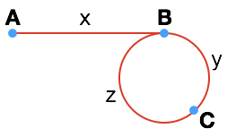

> 创建日期：2018年11月5日 星期一

[TOC]

# 描述

给定一个链表，返回链表开始入环的第一个节点。 如果链表无环，则返回 `null`。

**说明：**不允许修改给定的链表。

**进阶：**
你是否可以不用额外空间解决此题？

# 解法一：哈希表

## 思路

最直接的解法就是利用一个集合保存每次遍历的节点的引用。之后，从链表头开始遍历，每遍历一个节点，就判断该节点的引用是否在集合中，如果不在集合中，则将该节点的引用放入集合中；如果在集合中，则返回该节点的引用（环的入口）。当然，如果能遍历到链表尾部，此时链表无环，返回 `null`。

## Java 实现

```java
/**
 * Definition for singly-linked list.
 * class ListNode {
 *     int val;
 *     ListNode next;
 *     ListNode(int x) {
 *         val = x;
 *         next = null;
 *     }
 * }
 */

import java.util.Set;
import java.util.HashSet;

public class Solution {
    public ListNode detectCycle(ListNode head) {
        ListNode curr = head;
        Set<ListNode> nodesSeen = new HashSet<>();
        while (curr != null) {
            if (nodesSeen.contains(curr)) {
                return curr;
            }
            nodesSeen.add(curr);
            curr = curr.next;
        }
        return curr;
    }
}
```

## Python 实现

```python
# Definition for singly-linked list.
# class ListNode(object):
#     def __init__(self, x):
#         self.val = x
#         self.next = None

class Solution(object):
    def detectCycle(self, head):
        """
        :type head: ListNode
        :rtype: ListNode
        """
        curr = head
        nodes_seen = set()
        while curr:
            if curr in nodes_seen:
                return curr
            nodes_seen.add(curr)
            curr = curr.next
        return curr
```

## 复杂度分析

- **时间复杂度：**$O(n)$ 
- **空间复杂度：**$O(n)$ 

# 解法二：双指针

## 思路

和 [LeetCode 第 141 题](https://blog.csdn.net/x273591655/article/details/83343679)一样，如果不想占用额外的空间的话，可以采用双指针的方式。

假设链表的起始节点为 A，环的入口节点为 B，两个指针（快慢指针）相交节点为 C，AB 两点之间的长度为 $x$，BC 两点之间的长度为 $y$，CB 两点之间的长度为 $z$。慢指针 `slow` 走过的长度为 $x+y$，快指针 `fast` 为了“赶上”慢指针，应该走过的长度为 $x + y + z + y$，同时，由于快指针的速度是慢指针的两倍，因此相同时间内，快指针走过的路程应该是慢指针（走过的路程）的两倍，即


$$
x + y + z + y = 2 (x + y)
$$
化简得，
$$
x = z
$$
因此，如果此时有另外一个慢指针 `slow2` 从起始节点 A 出发，则两个慢指针会在节点 B （环的入口）相遇。

## Java 实现

```java
/**
 * Definition for singly-linked list.
 * class ListNode {
 *     int val;
 *     ListNode next;
 *     ListNode(int x) {
 *         val = x;
 *         next = null;
 *     }
 * }
 */

public class Solution {
    public ListNode detectCycle(ListNode head) {
        ListNode slow = head, fast = head;
        while (fast != null && fast.next != null) {
            slow = slow.next;
            fast = fast.next.next;
            
            if (slow == fast) {
                ListNode slow2 = head;
                while (slow != slow2) {
                    slow = slow.next;
                    slow2 = slow2.next;
                }
                return slow;
            }
        }
        return null;
    }
}
// Runtime: 1 ms
// Your runtime beats 100.00 % of python submissions.
```

## Python 实现

```python
# Definition for singly-linked list.
# class ListNode(object):
#     def __init__(self, x):
#         self.val = x
#         self.next = None

class Solution(object):
    def detectCycle(self, head):
        """
        :type head: ListNode
        :rtype: ListNode
        """
        slow, fast = head, head
        while fast and fast.next:
            slow = slow.next
            fast = fast.next.next
            
            if slow == fast:
                slow2 = head
                while slow != slow2:
                    slow = slow.next
                    slow2 = slow2.next
                return slow
        return None
# Runtime: 44 ms
# Your runtime beats 99.73 % of python submissions.
```

## 复杂度分析

- **时间复杂度：**$O(n)$，其中 $n$ 表示链表的长度。最坏的情况下（链表有环），需要迭代的次数为 $x + y + z = n$ 次，因此时间复杂度为 $O(n)$
- **空间复杂度：**$O(1)$，只需要存储 3 个引用