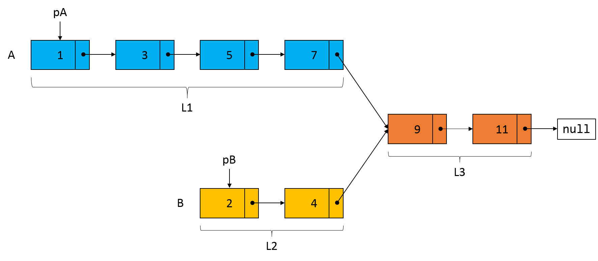
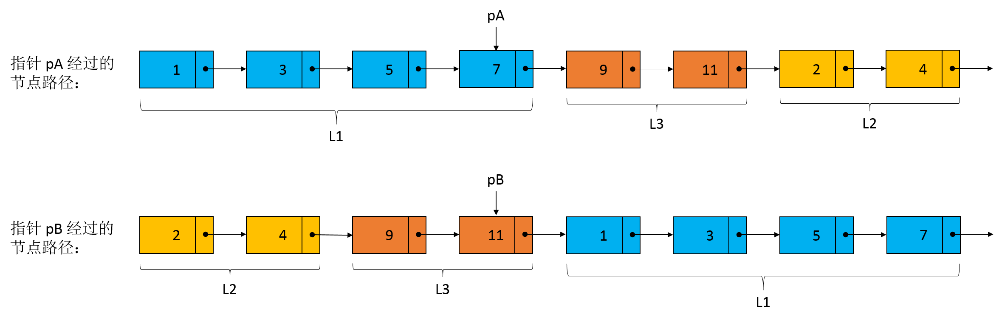
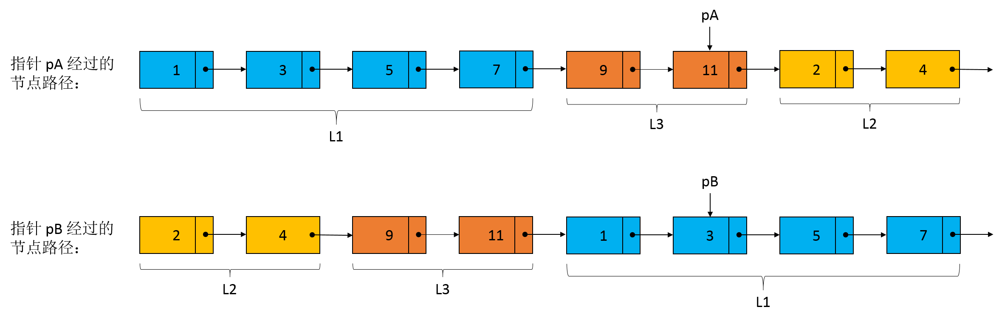
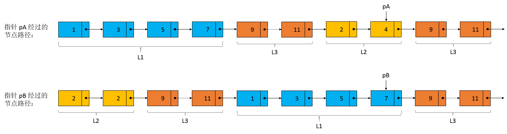

# 160_相交链表

[TOC]

## 描述

编写一个程序，找到两个单链表相交的起始节点。

例如，下面的两个链表**：**

```
A:          a1 → a2
                   ↘
                     c1 → c2 → c3
                   ↗            
B:     b1 → b2 → b3
```

在节点 c1 开始相交。

**注意：**

- 如果两个链表没有交点，返回 `null`.
- 在返回结果后，两个链表仍须保持原有的结构。
- 可假定整个链表结构中没有循环。
- 程序尽量满足 O(*n*) 时间复杂度，且仅用 O(*1*) 内存。

致谢**:**
特别感谢 [@stellari](https://oj.leetcode.com/discuss/user/stellari) 添加此问题并创建所有测试用例。

## 解法一：哈希表

### 思路

首先遍历链表 A 的所有节点，并将每个节点的引用存入哈希表中。接着，遍历链表 B 的每个节点，如果某个节点的引用在哈希表中存在，返回该节点的引用；如果遍历完链表 B 的所有节点没有发现这样一个节点，则返回 `null`。

### Java 实现

```java
/**
 * Definition for singly-linked list.
 * public class ListNode {
 *     int val;
 *     ListNode next;
 *     ListNode(int x) {
 *         val = x;
 *         next = null;
 *     }
 * }
 */
public class Solution {
    public ListNode getIntersectionNode(ListNode headA, ListNode headB) {
        if (headA == null || headB == null) {
            return null;
        }
        
        Set<ListNode> nodes = new HashSet<>();
        ListNode temp = headA;
        while (temp != null) {
            nodes.add(temp);
            temp = temp.next;
        }
        
        temp = headB;
        while (temp != null) {
            if (nodes.contains(temp)) {
                return temp;
            }
            temp = temp.next;
        }
        return null;
    }
}
```

**复杂度分析：**

- 时间复杂度：$O(m+n)$，其中，$m$ 表示链表 A 的节点数，$n$ 表示链表 B 的节点数，最坏的情况下，需要遍历两个链表的所有节点
- 空间复杂度：$O(m)$ 或者 $O(n)$

### Python 实现

```python
# Definition for singly-linked list.
# class ListNode(object):
#     def __init__(self, x):
#         self.val = x
#         self.next = None

class Solution(object):
    def getIntersectionNode(self, headA, headB):
        """
        :type head1, head1: ListNode
        :rtype: ListNode
        """
        if not headA or not headB:
            return None
        
        nodesA = set()
        curr = headA
        while curr:
            nodesA.add(curr)
            curr = curr.next
            
        curr = headB
        while curr:
            if curr in nodesA:
                return curr
            curr = curr.next
        return None
```

复杂度分析同上。

## 解法二：双指针（推荐）

### 思路

双指针解法顾名思义需要两个指针，假设指针 `pA` 和 `pB` 分别指向链表 A 和链表 B 的头结点，之后两个指针分别以步幅为 1 的速度向链表的尾部遍历，当指针 `pA` 遍历到链表 A 的尾节点时，将指针 `pA` 指向链表 B 的头部。同样地，当指针 `pB` 遍历到链表 B 的尾节点时，将指针 `pB` 指向链表 A 的头部。当两个指针相遇时，指针 `pA` 或者 `pB` 所指向的节点就是两个链表的相交节点。

为了说明双指针的求解思路，假设链表 A 和链表 B 的结构如下图所示，



其中，链表 A 包含 6 个节点，节点的值分别为 1、3、5、7、9 和 11；链表 B 包含 4 个节点，节点的值分别为 2、4、9 和 11，因此，两个链表的相交节点为 9。设链表 A 中不相交的部分（即蓝色部分的节点）长度为 $L1$，链表 B 中不相交的部分（即黄色部分的节点）长度为 $L2$，两个链表相交的部分（即红色部分的节点）长度为 $L3$。

如下图所示，当指针 `pB` 遍历到链表 B 的尾节点 11 时，指针 `pA` 遍历到链表 A 中节点 7 的位置，下一次遍历指针 `pB` 将处于链表 A 的节点 1 的位置。



同理，当指针 `pA` 遍历到链表 A 的尾节点 11 时，此时指针 `pB` 处于链表 A 中节点 3 的位置，下一次遍历指针 `pA` 将处于链表 B 的节点 2 位置。



再经过两次遍历后，指针 `pA` 将位于链表 B 中节点 4 的位置，而指针 `pB` 也将到达链表 A 的节点 4 的位置，下一次遍历两个指针将在节点 9（即相交节点）相遇。此时，两个指针走过的长度都为 $L1 + L2 + L3$。究其原因，可以将两个指针走过的“路程”看成 3 个部分，即蓝色部分、红色部分以及橙色部分，只是两个指针走过 3 个部分的顺序是不同的，指针 `pA` 先走蓝色部分而指针 `pB` 先走橙色部分，但是经过前 3 个部分后，两个指针走过的长度一定是相同的，因此在下一次遍历的时候两个指针一定会相遇。



### Java 实现

```java
/**
 * Definition for singly-linked list.
 * public class ListNode {
 *     int val;
 *     ListNode next;
 *     ListNode(int x) {
 *         val = x;
 *         next = null;
 *     }
 * }
 */
public class Solution {
    public ListNode getIntersectionNode(ListNode headA, ListNode headB) {
        if (headA == null || headB == null) {
            return null;
        }
        
        ListNode pA = headA;
        ListNode pB = headB;
        while (pA != pB) {
            pA = pA == null ? headB : pA.next;
            pB = pB == null ? headA : pB.next;
        }
        return pA;
    }
}
```

**复杂度分析：**

- 时间复杂度：$O(L1 + L2 + L3) = O(n)$，如果两个链表存在相交节点，则经过 $L1 + L2 + L3$ 的“长度”后，两个指针一定会相遇
- 空间复杂度：$O(1)$，只需要保存两个引用

### Python 实现

```python
# Definition for singly-linked list.
# class ListNode(object):
#     def __init__(self, x):
#         self.val = x
#         self.next = None

class Solution(object):
    def getIntersectionNode(self, headA, headB):
        """
        :type head1, head1: ListNode
        :rtype: ListNode
        """
        if not headA or not headB:
            return None
        
        p_a, p_b = headA, headB
        while p_a != p_b:
            if p_a:
                p_a = p_a.next
            else:
                p_a = headB
            
            if p_b:
                p_b = p_b.next
            else:
                p_b = headA
        return p_a
```

复杂度分析同上。