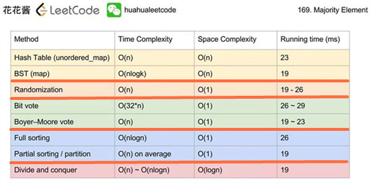

# 169_求众数（Majority-Element）

> 这道题有 5 种方法，8 种实现，详细分析可以看<u>**花花酱**</u>的 [YouTube 专栏](https://www.youtube.com/watch?v=LPIvL-jvGdA)。
>
> 

[TOC]

## 描述

给定一个大小为 *n* 的数组，找到其中的众数。众数是指在数组中出现次数**大于** `⌊ n/2 ⌋` 的元素。

你可以假设数组是非空的，并且给定的数组总是存在众数。

**示例 1:**

```
输入: [3,2,3]
输出: 3
```

**示例 2:**

```
输入: [2,2,1,1,1,2,2]
输出: 2
```

### 解法一：暴力法

### 思路

遍历数组中的每个元素，统计该元素出现的次数（嵌套遍历），如果该元素出现的次数 $> \left \lfloor n/2 \right \rfloor$，则该元素就是数组的众数。

### Java 实现

```java
class Solution {
    public int majorityElement(int[] nums) {
        int majorityCount = nums.length / 2;
        for (int num1 : nums) {
            int count = 0;
            for (int num2 : nums) {
                if (num2 == num1) {
                    ++count;
                }
            }
            if (count > majorityCount) {
                return num1;
            }
        }
        throw new IllegalArgumentException("The array does not contain a majority element!");
    }
}
```

### Python 实现

```python
class Solution:
    def majorityElement(self, nums):
        """
        :type nums: List[int]
        :rtype: int
        """
        majority_count = len(nums) // 2
        for num1 in nums:
            count = sum(1 for num2 in nums if num2 == num1)
            if count > majority_count:
                return num1
```

### 复杂度分析

- 时间复杂度：$O(n^2)$，其中 $n$ 表示数组的长度，由于嵌套了两层 `for` 循环，因此总的时间复杂度是 $O(n^2)$ 的 
- 空间复杂度：$O(1)$

## 解法二：哈希表

### 思路

利用哈希表记录数组中元素出现的次数，由于哈希表的插入操作的时间复杂度是 $O(1)$ 的，所以遍历整个数组统计出现次数的操作的时间复杂度是 $O(n)$ 的。接着，再遍历一遍哈希表，取出众数。

### Java 实现

```java
class Solution {
    public int majorityElement(int[] nums) {
        Map<Integer, Integer> counts = new HashMap<>();
        for (int num : nums) {
            if (counts.containsKey(num)) {
                counts.replace(num, counts.get(num) + 1);
            } else {
                counts.put(num, 1);
            }
        }
        
        Map.Entry<Integer, Integer> majorityEntry = null;
        for (Map.Entry<Integer, Integer> entry : counts.entrySet()) {
            if (majorityEntry == null || entry.getValue() > majorityEntry.getValue()) {
                majorityEntry = entry;
            }
        }
        
        return majorityEntry.getKey();
    }
}
```

### Python 实现

```python
class Solution:
    def majorityElement(self, nums):
        """
        :type nums: List[int]
        :rtype: int
        """
        counts = dict()
        for num in nums:
            counts[num] = counts.get(num, 0) + 1
		return max(counts, key=counts.get)
```

### 复杂度分析

- 时间复杂度：$O(n)$，其中 $n$ 为数组的长度。由于哈希表中元素的数目最多为 $n - \left( \left \lfloor n/2 \right \rfloor + 1 \right) + 1 = n - \left \lfloor n/2 \right \rfloor$，因此遍历一次哈希表最多需要 $n - \left \lfloor n/2 \right \rfloor$ 次操作，而遍历一遍数组需要 $n$ 次操作，所以总的时间复杂度是 $O(n)$ 的
- 空间复杂度：$O(n)$，因为哈希表最多需要保存 $n - \left \lfloor n/2 \right \rfloor$ 个元素

## 解法三：排序

将数组按照顺序（递增或者递减）排列好后，索引为 $\left \lfloor n/2 \right \rfloor$ 的元素就是数组的众数。

### Java 实现

```java
class Solution {
    public int majorityElement(int[] nums) {
        Arrays.sort(nums);
        return nums[nums.length / 2];
    }
}
```

### Python 实现

```python
class Solution:
    def majorityElement(self, nums):
        """
        :type nums: List[int]
        :rtype: int
        """
        return sorted(nums)[len(nums) // 2]
```

### 复杂度分析

- 时间复杂度：$O(n \log(n))$，其中 $n$ 表示数组的长度，对数组进行排序的时间复杂度为 $O(n \log(n))$ 的
- 空间复杂度：$O(n)$ 或者 $O(1)$，取决于是否可以直接对原数组直接进行排序，如果不允许的话，需要额外的空间复制数组

## 解法四：随机选择【待完成】

### 思路


### Java实现


### Python 实现


### 复杂度分析


## 解法五：分而治之（Divide and conquer）【待完成】

### 思路


### Java 实现


### Python 实现


### 复杂度分析


## 解法六：多数投票算法（Boyer-Moore majority vote algorithm）

### 思路

多数投票算法一般用于寻找一个序列的多数元素（只需要线性时间和常数空间），是一种典型的流式算法（streaming algorithm）。但是，一般来说，该算法无法找到一个序列的众数（mode），除非众数出现的次数大于 $\lfloor n/2 \rfloor$ 次。多数投票算法的思想是这样：统计一个序列中的所有元素，将多数元素记为 $+1$，其余的元素记为 $-1$，那么最后的和一定是正的。具体地，该算法会维护两个变量，一个用于记录序列中的元素，记为 `m`，一个作为计数器，记为 `count`。遍历数组中的每个元素，如果当前的 `count` 为 0，则将当前元素保存在 `m` 中，并设 `count` 为1；如果 `count` 不为0，则判断当前元素与 `m` 是否相等，相等则 `count` 加一，不等则 `count` 减一。遍历结束，变量 `m` 就是我们寻找的多数元素。

### Java 实现

```java
class Solution {
    public int majorityElement(int[] nums) {
        int me = nums[0], count = 1;
        for (int i = 1; i < nums.length; ++i) {
            if (count == 0) {
                me = nums[i];
                count = 1;
            } else if (me == nums[i]) {
                ++count;
            } else {
                --count;
            }
        }
        return me;
    }
}
```

### Python 实现

```python
class Solution:
    def majorityElement(self, nums):
        """
        :type nums: List[int]
        :rtype: int
        """
        me, count = 0, 0
        for num in nums:
            if count == 0:
                me, count = num, 1
            elif me == num:
                count += 1
            else:
                count -= 1
        return me    
```

### 复杂度分析

- 时间复杂度：$O(n)$，其中 $n$ 表示数组的长度
- 空间复杂度：$O(1)$