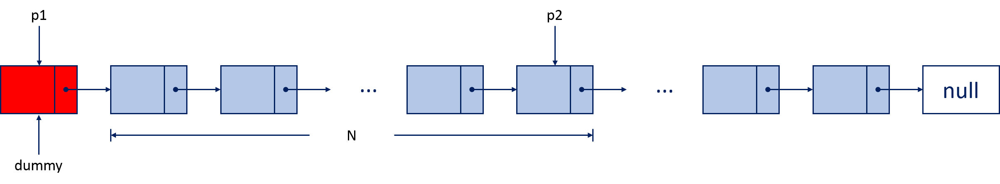
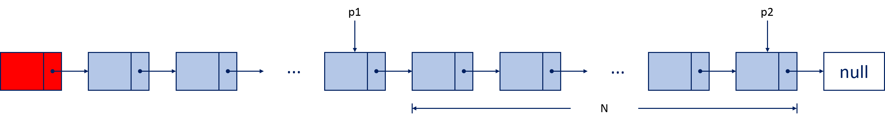

> 更多 LeetCode 题解笔记可以访问我的 [github](https://github.com/Genpeng/play-with-leetcode)。

[TOC]

# 描述

给定一个链表，删除链表的倒数第 *n* 个节点，并且返回链表的头结点。

**示例**：

```
给定一个链表: 1->2->3->4->5, 和 n = 2.

当删除了倒数第二个节点后，链表变为 1->2->3->5.
```

**说明**：

给定的 *n* 保证是有效的。

**进阶**：

你能尝试使用一趟扫描实现吗？

## 解法：双指针

## 思路

求解这道问题等价于寻找倒数的第 $N+1$ 个节点，然后将该节点的 `next` 指针执行倒数第 $N - 1$ 个节点。 为了找到倒数第 $N + 1$ 个节点，我们必须借助一把长度可变尺子——双指针。

具体的做法如下：

**第 0 步（准备阶段）**：为了方便对头节点进行删除，统一删除节点的操作，我们创建一个虚拟的头节点，接着，再创建两个指针（`p1` 和 `p2`）指向虚拟头节点；


**第一步**：将 `p2` 指针移动 $N$ 步，此时，`p2` 指针位于第 $N$ 个节点，两个指针之间的长度为 $N + 1$，这就是我们的尺子；



**第二步**：移动我们的尺子（同时移动两个指针），直到 `p2` 指针到达链表的尾部，此时，`p1` 指针的 `next` 引用所指向的正是倒数第 $N$ 个节点；



最后，我们只需要操作 `p1` 指针的 `next` 引用，使得它指向倒数第 $N - 1$ 个节点即可实现对于倒数第 $N$ 个节点的删除操作。

## Java 实现

```java
/**
 * Definition for singly-linked list.
 * public class ListNode {
 *     int val;
 *     ListNode next;
 *     ListNode(int x) { val = x; }
 * }
 */
class Solution {
    public ListNode removeNthFromEnd(ListNode head, int n) {
        if (head == null || head.next == null) {
            return null;
        }
        
        // 创建一个虚拟头节点
        ListNode dummy = new ListNode(-1);
        dummy.next = head;

        // 创建两个指针，并将p2指针移动n步
        ListNode p1 = dummy, p2 = dummy;
        for (int i = 0; i < n; ++i) {
            p2 = p2.next;
        }

        // 移动两个指针直到p2处于链表尾部
        while (p2.next != null) {
            p1 = p1.next;
            p2 = p2.next;
        }
        
        // 删除第n个节点
        // ListNode nthNode = p1.next;
        p1.next = p1.next.next;
        // nthNode.next = null;
        
        return dummy.next;
    }
}
// Runtime: 6 ms
// Your runtime beats 100.00 % of java submissions.
```

## Python 实现

```python
# Definition for singly-linked list.
# class ListNode:
#     def __init__(self, x):
#         self.val = x
#         self.next = None

class Solution:
    def removeNthFromEnd(self, head, n):
        """
        :type head: ListNode
        :type n: int
        :rtype: ListNode
        """
        if not head or not head.next:
            return None
        
        # 创建虚拟头节点
        dummy = ListNode(-1)
        dummy.next = head
        
        # 创建两个指针，并将指针p2移动n步
        p1, p2 = dummy, dummy
        for i in range(n):
            p2 = p2.next
            
        # 同时移动两个指针，直到p2位于链表的尾部
        while p2.next:
            p1, p2 = p1.next, p2.next
            
        # 删除倒数第n个节点
        p1.next = p1.next.next
        
        return dummy.next
# Runtime: 36 ms
# Your runtime beats 100.00 % of python3 submissions.
```

## 复杂度分析

- **时间复杂度**：$O(n)$，其中 $n$ 表示链表的长度。首先需要 $N$ 次操作将 `p2` 指针移动到第 $N$ 个节点；接着，需要 $2 \times (n-N)$ 次操作将 `p2` 指针移动到链表尾部，同时将`p1` 移动到倒数第 $N + 1$ 个节点。因此，总的时间复杂度是 $O(n)$ 的。
- **空间复杂度**：$O(1)$ 