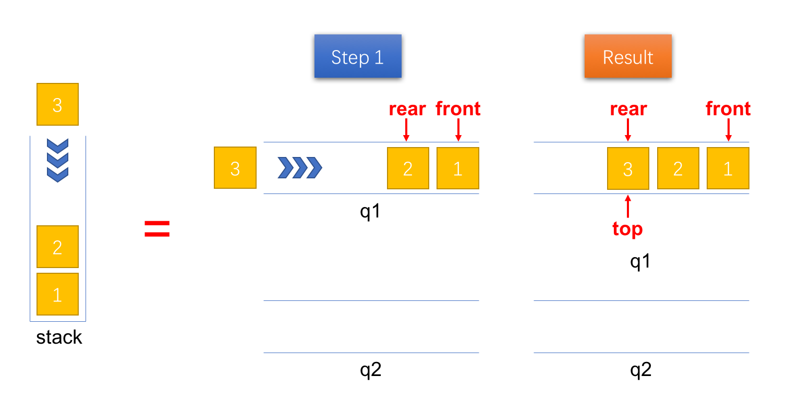
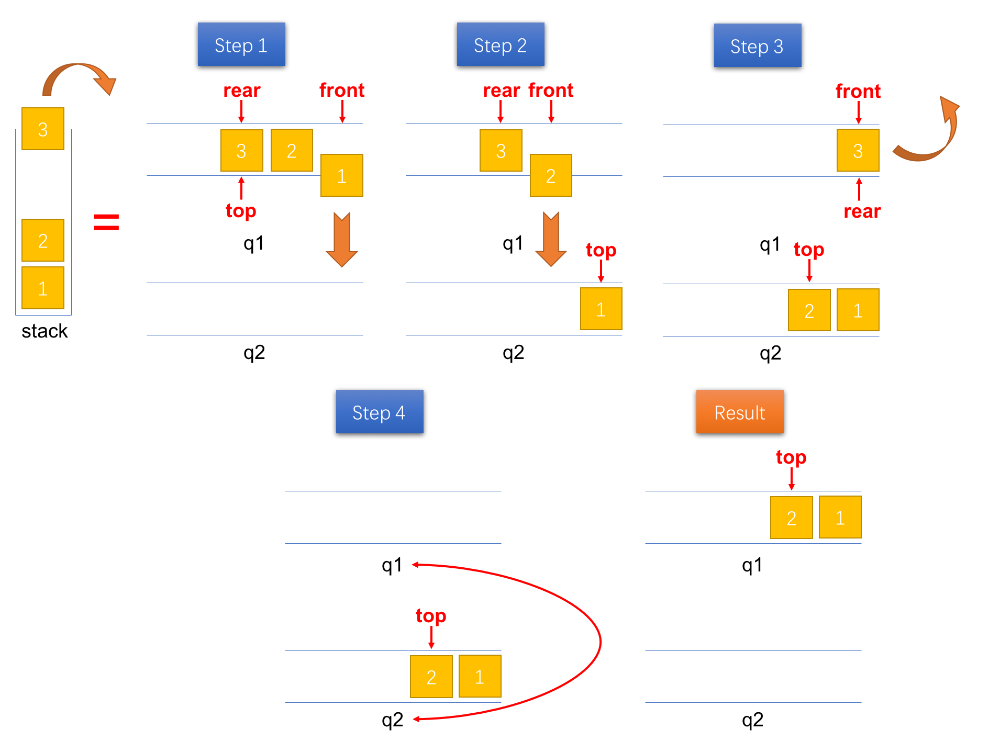
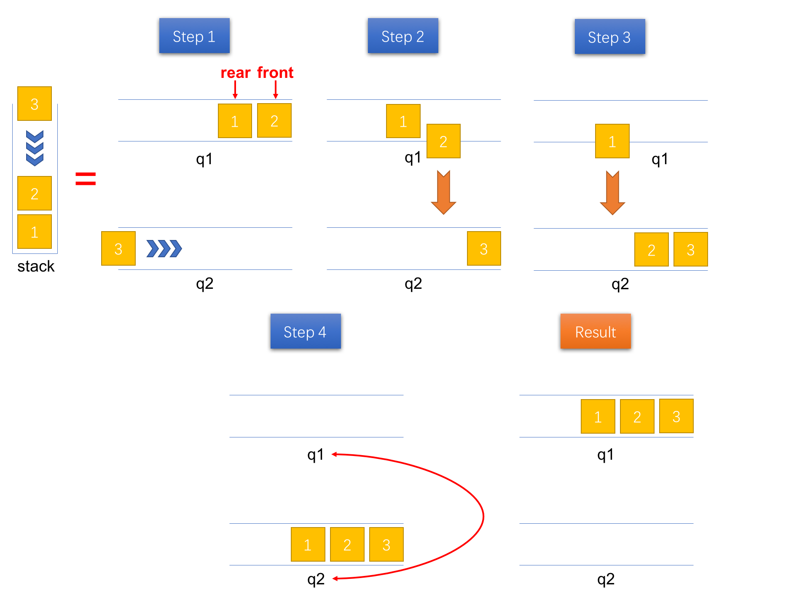
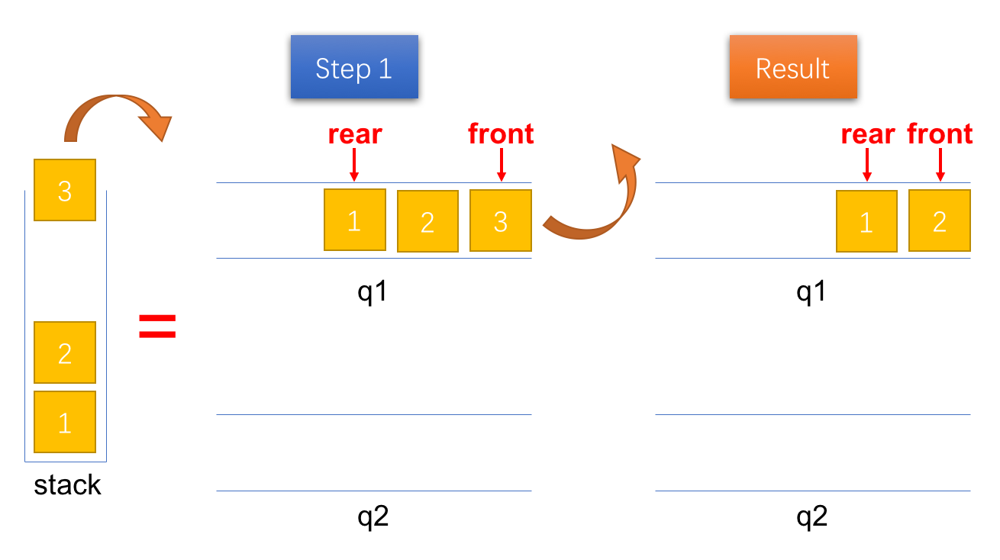
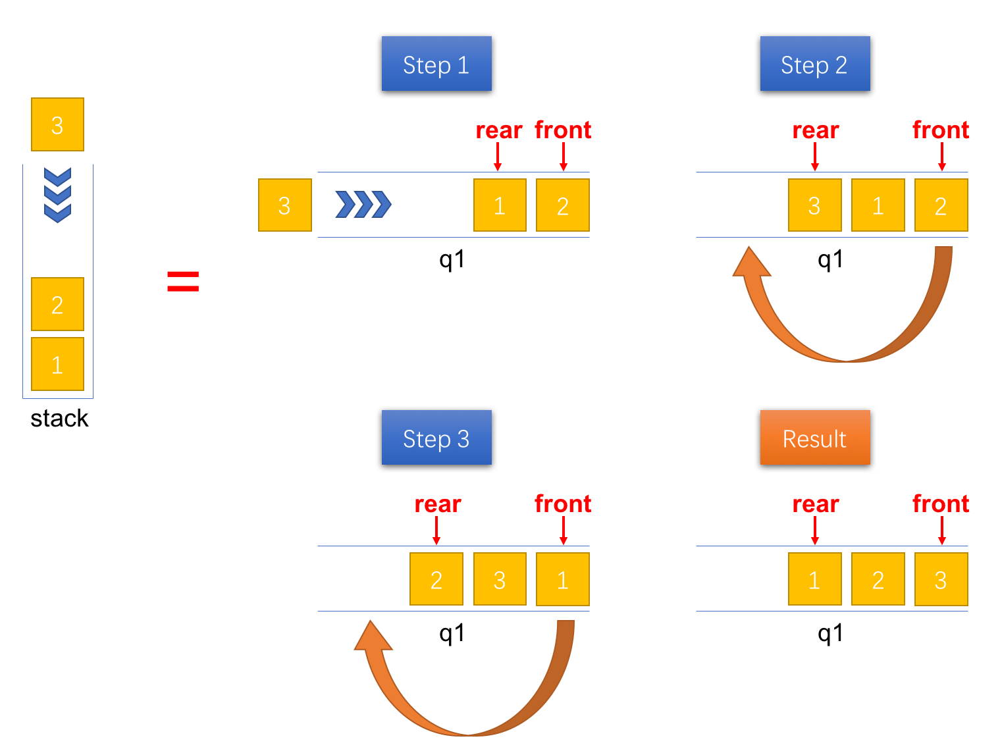
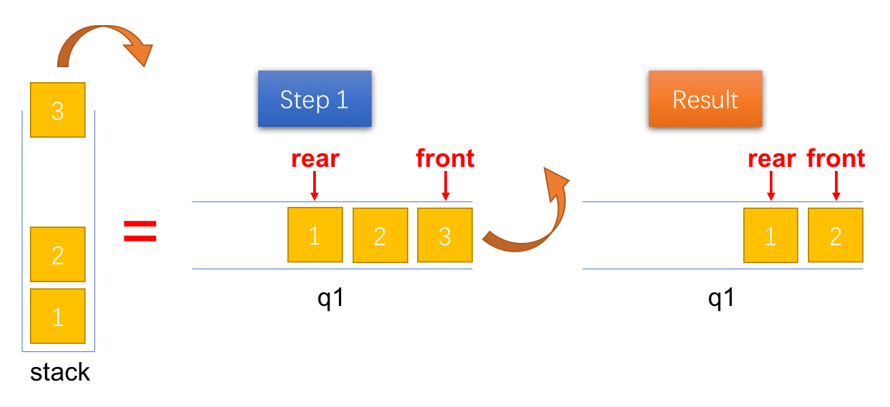

> 更多 LeetCode 题解笔记可以访问我的 [github](https://github.com/Genpeng/play-with-leetcode)。

[TOC]

# 描述

使用队列实现栈的下列操作：

- push(x) -- 元素 x 入栈
- pop() -- 移除栈顶元素
- top() -- 获取栈顶元素
- empty() -- 返回栈是否为空

**注意:**

- 你只能使用队列的基本操作-- 也就是 `push to back`, `peek/pop from front`, `size`, 和 `is empty` 这些操作是合法的。
- 你所使用的语言也许不支持队列。 你可以使用 list 或者 deque（双端队列）来模拟一个队列 , 只要是标准的队列操作即可。
- 你可以假设所有操作都是有效的（例如, 对一个空的栈不会调用 pop 或者 top 操作）。

# 解法一：双队列，入快出慢

## 思路

为了实现栈这种数据结构后入先出（last in first out, LIFO）的效果，解法一借助于两个队列。其中，一个队列保存栈的所有元素（设为队列1 `q1`），另一个队列用于辅助实现入栈、出栈的效果（设为队列2 `q2`）。相关操作的底层实现细节见下面对应的小节。

### 入栈（push）

入栈时，直接将新的元素 `x` 压入队列1 `q1` 的队尾（rear），并且用变量 `top` 保存栈顶元素，方便后面的查看栈顶元素（peek）操作，具体的实现步骤见图1。



<p align=center><small>图1：将一个元素压入栈</small></p>

代码（Java）实现如下：

```java
/** Push element x onto stack. */
public void push(int x) {
    top = x;
    q1.add(x);
}
```

复杂度分析如下：

- 时间复杂度：$ O(1) $
- 空间复杂度：$ O(1) $

### 出栈（pop）

由于入栈时直接将元素入队到队列1 `q1` 中，因此，栈顶的元素位于队列1 `q1` 的尾部。为了能将栈顶元素（队列1 `q1` 尾部的元素）弹出，必须先将队列1 `q1` 队尾之前的元素出队。这里，我们借助另一个队列（辅助队列 `q2`）实现这一过程——将队列1 `q1` 队尾之前的元素出队并入队到队列2 `q2` 中。 之后，将队列1 `q1` 中唯一个元素（栈顶元素）出队。最后，再将两个队列的引用进行交换即可完成出栈操作。具体的实现步骤如图2所示。



<p align=center><small>图2：将一个元素出栈</small></p>

代码（Java）实现如下：

```java
/** Removes the element on top of the stack and returns that element. */
public int pop() {
    if (q1.size() == 0) {
        throw new NoSuchElementException("[ERROR] The queue is empty!");
    }

    while (q1.size() > 1) {
        top = q1.remove();
        q2.add(top);
    }
    int res = q1.remove();

    Queue<Integer> temp = q1;
    q1 = q2;
    q2 = temp;

    return res;
}
```

复杂度分析如下：

- 时间复杂度：$ O(n) $，其中 $n$ 表示未出栈前元素的数目。出栈操作需要从队列1 `q1` 出队 $n$ 个元素，同时入队 $n-1$ 个元素到队列2 `q2`，因此需要 $2n - 1$ 次操作。因此 `LinkedList` 的添加和删除操作的时间复杂度是 $O(1)$ 的，因此，总的时间复杂度为 $O(n)$ 
- 空间复杂度：$ O(1) $

### 查看栈顶元素（peek）

因为我们用变量 `top` 保存了栈顶的元素，因此只需要返回该变量即可，代码（Java）实现如下：

```java
/** Get the top element. */
public int top() {
    return top;
}
```

复杂度分析如下：

- 时间复杂度：$ O(1) $
- 空间复杂度：$ O(1) $

### 是否为空（empty）

队列1 `q1` 中保存了栈中的所有元素，因此，如果想要知道栈是否为空，只需要判断队列1 `q1` 中是否还有元素，代码（Java）实现如下：

```java
/** Returns whether the stack is empty. */
public boolean empty() {
	return q1.isEmpty();
}
```

复杂度分析如下：

- 时间复杂度：$ O(1) $
- 空间复杂度：$ O(1) $

## Java 实现

```java
import java.util.NoSuchElementException;
import java.util.LinkedList;
import java.util.Queue;

class MyStack {

    /**
     * The main queue using to store all the elements in the stack
     */
    private Queue<Integer> q1;
    /**
     * The auxiliary queue using to implement `pop` operation
     */
    private Queue<Integer> q2;
    /**
     * The top element in the stack
     */
    private int top;

    /** Initialize your data structure here. */
    public MyStack() {
        q1 = new LinkedList<>();
        q2 = new LinkedList<>();
    }

    /** Push element x onto stack. */
    public void push(int x) {
        top = x;
        q1.add(x);
    }

    /** Removes the element on top of the stack and returns that element. */
    public int pop() {
        if (q1.size() == 0) {
            throw new NoSuchElementException("[ERROR] The stack is empty!");
        }

        while (q1.size() > 1) {
            top = q1.remove();
            q2.add(top);
        }
        int res = q1.remove();

        Queue<Integer> temp = q1;
        q1 = q2;
        q2 = temp;

        return res;
    }

    /** Get the top element. */
    public int top() {
        return top;
    }

    /** Returns whether the stack is empty. */
    public boolean empty() {
        return q1.isEmpty();
    }
}
```

## Python 实现

```python
from collections import deque

class MyStack:

    def __init__(self):
        """
        Initialize your data structure here.
        """
        self._q1, self._q2, self._top = deque(), deque(), None
        

    def push(self, x):
        """
        Push element x onto stack.
        :type x: int
        :rtype: void
        """
        self._top = x
        self._q1.append(x)
        

    def pop(self):
        """
        Removes the element on top of the stack and returns that element.
        :rtype: int
        """
        if not self._q1:
            raise Exception("[ERROR] The stack is empty!")
            
        while len(self._q1) > 1:
            self._top = self._q1.popleft()
            self._q2.append(self._top)
        res = self._q1.popleft()
        
        self._q1, self._q2 = self._q2, self._q1
        return res
        

    def top(self):
        """
        Get the top element.
        :rtype: int
        """
        return self._top
        

    def empty(self):
        """
        Returns whether the stack is empty.
        :rtype: bool
        """
        return not self._q1
```


# 解法二：双队列，入慢出快

## 思路

与解法一相同的是，解法二也借助于两个队列。不同之处在于解法二在入栈时，已经在队列中将元素排列成出栈的顺序。因此，解法二实现的栈的入栈操作是 $O(n)$ 的时间复杂度，而出栈操作则只需要 $O(1)$ 的时间复杂度。相关操作的底层实现细节见下面对应的小节。

### 入栈（push）

为了使得队列1 `q1` 中的出队顺序和出栈顺序是一致的，需要借助另一个队列（辅助队列 `q2`）。每次有新的元素压入栈时，将该元素入队到队列2 `q2` 中。接着，将队列1 `q1` 中的所有元素出队并入队到队列2 `q2` 中。最后，再将两个队列的引用进行交换，则队列1 `q1` 中出队的顺序即为实际的出栈顺序。具体的操作步骤如图3所示。



<p align=center><small>图3：将一个元素压入栈</small></p>

代码（Java）实现如下：

```java
/** Push element x onto stack. */
public void push(int x) {
    q2.add(x);
    while (!q1.isEmpty()) {
        q2.add(q1.remove());
    }

    Queue<Integer> temp = q1;
    q1 = q2;
    q2 = temp;
}
```

复杂度分析如下：

- 时间复杂度：$O(n)$，其中 $n$ 表示入栈前元素的数目。入栈操作需要 $n+1$ 个入队操作，同时还需要 $n$ 个出队操作，因此，总共需要 $2n + 1$ 个操作。由于 `LinkedList` 的添加和删除操作的时间复杂度是 $O(1)$ 的，因此，总的时间复杂度是 $O(n)$ 的
- 空间复杂度：$O(1)$ 

### 出栈（pop）

由于在入栈时已经将队列中的元素排列成出栈的顺序，因此，只需要出队队列1 `q1` 中队首的元素即可。



<p align=center><small>图4：将一个元素出栈</small></p>

代码（Java）实现如下：

```java
/** Removes the element on top of the stack and returns that element. */
public int pop() {
    if (q1.isEmpty()) {
        throw new NoSuchElementException("[ERROR] The stack is empty!");
    }

    return q1.remove();
}
```

复杂度分析如下：

- 时间复杂度：$ O(1) $
- 空间复杂度：$ O(1) $

### 查看栈顶元素（peek）

同理，只需要返回队列1 `q1` 队首元素即可。

```java
/** Get the top element. */
public int top() {
    if (q1.isEmpty()) {
        throw new NoSuchElementException("[ERROR] The stack is empty!");
    }

    return q1.peek();
}
```

复杂度分析如下：

- 时间复杂度：$ O(1) $
- 空间复杂度：$ O(1) $

### 是否为空（empty）

这个操作和解法一的没什么不同，故不再赘言。

## Java 实现

```java
import java.util.LinkedList;
import java.util.NoSuchElementException;
import java.util.Queue;

class MyStack {
    private Queue<Integer> q1;
    private Queue<Integer> q2;

    /** Initialize your data structure here. */
    public MyStack() {
        q1 = new LinkedList<>();
        q2 = new LinkedList<>();
    }

    /** Push element x onto stack. */
    public void push(int x) {
        q2.add(x);
        while (!q1.isEmpty()) {
            q2.add(q1.remove());
        }

        Queue<Integer> temp = q1;
        q1 = q2;
        q2 = temp;
    }

    /** Removes the element on top of the stack and returns that element. */
    public int pop() {
        if (q1.isEmpty()) {
            throw new NoSuchElementException("[ERROR] The stack is empty!");
        }

        return q1.remove();
    }

    /** Get the top element. */
    public int top() {
        if (q1.isEmpty()) {
            throw new NoSuchElementException("[ERROR] The stack is empty!");
        }

        return q1.peek();
    }

    /** Returns whether the stack is empty. */
    public boolean empty() {
        return q1.isEmpty();
    }
}
```

## Python 实现

```python
from collections import deque

class MyStack:

    def __init__(self):
        """
        Initialize your data structure here.
        """
        self._q1, self._q2 = deque(), deque()
        

    def push(self, x):
        """
        Push element x onto stack.
        :type x: int
        :rtype: void
        """
        self._q2.append(x)
        while self._q1:
            self._q2.append(self._q1.popleft())
        self._q1, self._q2 = self._q2, self._q1
        

    def pop(self):
        """
        Removes the element on top of the stack and returns that element.
        :rtype: int
        """
        if not self._q1:
            raise Exception("[ERROR] The stack is empty!")
        return self._q1.popleft()

    def top(self):
        """
        Get the top element.
        :rtype: int
        """
        if not self._q1:
            raise Exception("[ERROR] The stack is empty!")
        return self._q1[0]
        

    def empty(self):
        """
        Returns whether the stack is empty.
        :rtype: bool
        """
        return not self._q1
```

# 解法三：单队列

## 思路

上面两种解法都借助于两个队列，实际上，只借助于一个队列也可以实现栈的先入先出效果。

### 入栈（push）

入栈时，新添加的元素位于队列的队尾，但是对于栈而言，它其实是栈顶元素。为了使得新添加的元素位于队首，可以将其之前的所有元素出队并重新入队。最终，队列中元素的顺序和出栈的顺序是一致的。具体的操作步骤如下图所示。



<p align=center><small>图5：将一个元素压入栈</small></p>

代码（Java）实现如下：

```java
/** Push element x onto stack. */
public void push(int x) {
    queue.add(x);
    for (int i = 0; i < queue.size() - 1; ++i) {
        queue.add(queue.remove());
    }
}
```

复杂度分析：

- 时间复杂度：$O(n)$，其中 $n$ 表示入栈前栈内元素的数目。入栈操作需要 $n$ 次的出队操作，同时也需要 $n + 1$次的入队操作，因此，需要总的操作次数为 $2n + 1$ 次。由于 `LinkedList` 的添加和删除操作的时间复杂度是 $O(1)$ 的，因此，总的时间复杂度为 $O(n)$ 
- 空间复杂度：$O(1)$ 

### 出栈（pop）

由于在入栈时已经将队列中的元素排列成出栈的顺序，因此，只需要出队队列 `q1` 中队首的元素即可。



<p align=center><small>图6：将一个元素出栈</small></p>

代码（Java）实现如下：

```java
/** Removes the element on top of the stack and returns that element. */
public int pop() {
    if (queue.isEmpty()) {
        throw new NoSuchElementException("[ERROR] The stack is empty!");
    }

    return queue.remove();
}
```

复杂度分析如下：

- 时间复杂度：$ O(1) $
- 空间复杂度：$ O(1) $

### 查看栈顶元素（peek）

同理，只需要返回队列 `q1` 的队首元素即可。

```java
/** Get the top element. */
public int top() {
    if (queue.isEmpty()) {
        throw new NoSuchElementException("[ERROR] The stack is empty!");
    }

    return queue.peek();
}
```

复杂度分析如下：

- 时间复杂度：$ O(1) $
- 空间复杂度：$ O(1) $

### 是否为空（empty）

队列 `q1` 中保存了栈中的所有元素，因此，如果想要知道栈是否为空，只需要判断队列 `q1` 中是否还有元素，代码（Java）实现如下：

```java
/** Returns whether the stack is empty. */
public boolean empty() {
    return queue.isEmpty();
}
```

复杂度分析如下：

- 时间复杂度：$ O(1) $
- 空间复杂度：$ O(1) $

## Java 实现

```java
import java.util.LinkedList;
import java.util.NoSuchElementException;
import java.util.Queue;

class MyStack {
    private Queue<Integer> queue;

    /** Initialize your data structure here. */
    public MyStack() {
        queue = new LinkedList<>();
    }

    /** Push element x onto stack. */
    public void push(int x) {
        queue.add(x);
        for (int i = 0; i < queue.size() - 1; ++i) {
            queue.add(queue.remove());
        }
    }

    /** Removes the element on top of the stack and returns that element. */
    public int pop() {
        if (queue.isEmpty()) {
            throw new NoSuchElementException("[ERROR] The stack is empty!");
        }

        return queue.remove();
    }

    /** Get the top element. */
    public int top() {
        if (queue.isEmpty()) {
            throw new NoSuchElementException("[ERROR] The stack is empty!");
        }

        return queue.peek();
    }

    /** Returns whether the stack is empty. */
    public boolean empty() {
        return queue.isEmpty();
    }
}

/**
 * Your MyStack object will be instantiated and called as such:
 * MyStack obj = new MyStack();
 * obj.push(x);
 * int param_2 = obj.pop();
 * int param_3 = obj.top();
 * boolean param_4 = obj.empty();
 */
```

## Python 实现

```python
from collections import deque

class MyStack:

    def __init__(self):
        """
        Initialize your data structure here.
        """
        self._q = deque()
        

    def push(self, x):
        """
        Push element x onto stack.
        :type x: int
        :rtype: void
        """
        self._q.append(x)
        for _ in range(len(self._q) - 1):
            self._q.append(self._q.popleft())
        

    def pop(self):
        """
        Removes the element on top of the stack and returns that element.
        :rtype: int
        """
        if not self._q:
            raise Exception("[ERROR] The stack is empty!")
        return self._q.popleft()

    def top(self):
        """
        Get the top element.
        :rtype: int
        """
        if not self._q:
            raise Exception("[ERROR] The stack is empty!")
        return self._q[0]
        

    def empty(self):
        """
        Returns whether the stack is empty.
        :rtype: bool
        """
        return not self._q
```

