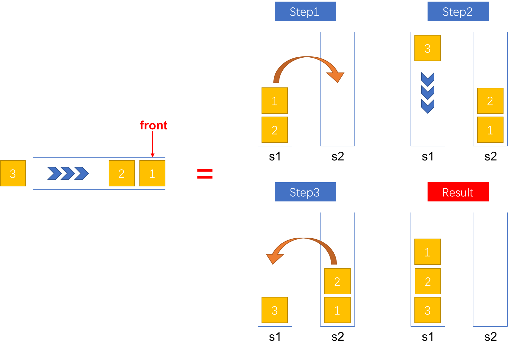
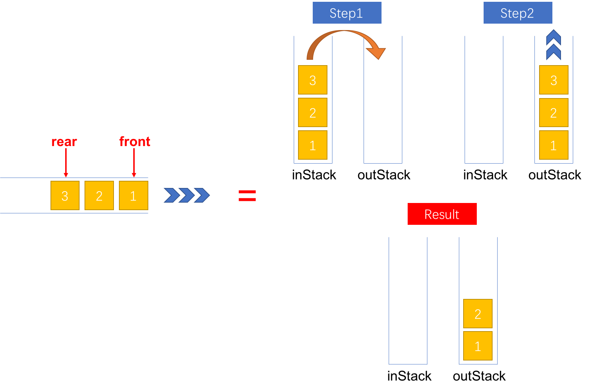

> 更多 LeetCode 题解笔记可以访问我的 [github](https://github.com/Genpeng/play-with-leetcode)。

[TOC]

# 描述

使用栈实现队列的下列操作：

- push(x) -- 将一个元素放入队列的尾部。
- pop() -- 从队列首部移除元素。
- peek() -- 返回队列首部的元素。
- empty() -- 返回队列是否为空。

**示例:**

```
MyQueue queue = new MyQueue();

queue.push(1);
queue.push(2);  
queue.peek();  // 返回 1
queue.pop();   // 返回 1
queue.empty(); // 返回 false
```

**说明:**

- 你只能使用标准的栈操作 -- 也就是只有 `push to top`, `peek/pop from top`, `size`, 和 `is empty` 操作是合法的。
- 你所使用的语言也许不支持栈。你可以使用 list 或者 deque（双端队列）来模拟一个栈，只要是标准的栈操作即可。
- 假设所有操作都是有效的 （例如，一个空的队列不会调用 pop 或者 peek 操作）。

# 解法一：在一个栈中维持所有元素的出队顺序

## 思路

队列是一种先入先出（first in first out, FIFO）的数据结构，而栈是一种后入先出（last in first out, LIFO）的数据结构。因此，如果要使用栈来达到队列的效果，即用有后入先出性质的数据结构来实现先入先出的效果，需要借用两个栈来改变元素的出队顺序。当然，借用两个栈来实现队列也有不同的实现方式，这一节介绍第一种实现方式，在下一小节介绍第二种方式。

第一种方式是<u>**在一个栈中维持所有元素的出队顺序**</u>，即所有的元素在入队操作完成后只会保存在一个栈中，且其出栈的顺序和出队的顺序是一致的。下面对入队、出队等操作的底层实现分别进行讲解。

### 入队（push）

为了实现出栈顺序和出队顺序是一致的，*入栈时必须将新的元素压入栈底*。为了实现这种效果，在入队时，首先将栈1（假设栈1中保存所有的元素）中所有的元素弹出并压入栈2中，接着将新的元素压入栈1中，最后再将栈2中的所有弹出并压入栈1中。详细的步骤如图1所示。



<p align="center"><small>图1：将一个元素入队</small></p>

代码（Java）实现如下。

```java
public void push(int x) {
    // 将栈1中的所有元素弹出并压入栈2中
    while (!s1.isEmpty()) {
        s2.push(s1.pop());
    }

    // 将新的元素压入栈1
    s1.push(x);

    // 将栈2的所有元素弹出并压入栈1
    while (!s2.isEmpty()) {
        s1.push(s2.pop());
    }
}
```

复杂度分析如下：

- 时间复杂度：$O(n)$，其中 $n$ 表示入队时队列元素的数目，即栈1中元素的数目。入队时，栈1中的元素需要进行出栈和入栈两次，需要 $4n$ 次操作，再加上新的元素的一次入栈操作，总的操作次数为 $4n + 1$ 次。由于栈的入栈和出栈的时间复杂度是 $O(1)$ 的，因此，入队的时间复杂度是 $O(n)$ 的
- 空间复杂度：$O(n)$ 

### 出队（pop）

出队操作比较简单，由于栈1中元素的出栈顺序和队列的出队顺序一致，因此，只需要弹出栈顶元素即可完成出队操作。

```java
public int pop() {
    if (s1.isEmpty()) {
        throw new IllegalArgumentException("[ERROR] The queue is empty!");
    }

    return s1.pop();
}
```

复杂度分析如下：

- 时间复杂度：$O(1)$ 
- 空间复杂度：$O(1)$ 

### 查看队首（peek）

与出队操作类似，只需要查看栈1栈顶的元素即可完成查看队首的操作。

```java
public int peek() {
    if (s1.isEmpty()) {
        throw new IllegalArgumentException("[ERROR] The queue is empty!");
    }

    return s1.peek();
}
```

复杂度分析如下：

- 时间复杂度：$O(1)$ 
- 空间复杂度：$O(1)$ 

### 是否为空（empty）

由于栈1中保存队列的所有元素，因此只需要判断栈1是否为空即可知道队列是否为空。

```javascript
public boolean empty() {
    return s1.isEmpty();
}
```

复杂度分析如下：

- 时间复杂度：$O(1)$ 
- 空间复杂度：$O(1)$ 

## Java 实现

```java
class MyQueue {
    private Stack<Integer> s1;
    private Stack<Integer> s2;

    /** Initialize your data structure here. */
    public MyQueue() {
        s1 = new Stack<>();
        s2 = new Stack<>();
    }

    /** Push element x to the back of queue. */
    public void push(int x) {
        while (!s1.isEmpty()) {
            s2.push(s1.pop());
        }
        s1.push(x);
        while (!s2.isEmpty()) {
            s1.push(s2.pop());
        }
    }

    /** Removes the element from in front of queue and returns that element. */
    public int pop() {
        if (s1.isEmpty()) {
            throw new IllegalArgumentException("[ERROR] The queue is empty!");
        }

        return s1.pop();
    }

    /** Get the front element. */
    public int peek() {
        if (s1.isEmpty()) {
            throw new IllegalArgumentException("[ERROR] The queue is empty!");
        }

        return s1.peek();
    }

    /** Returns whether the queue is empty. */
    public boolean empty() {
        return s1.isEmpty();
    }
}
```

## Python 实现

```python
class MyQueue:
    def __init__(self):
        """
        Initialize your data structure here.
        """
        self._s1, self._s2 = [], []
        
    def push(self, x):
        """
        Push element x to the back of queue.
        :type x: int
        :rtype: void
        """
        while self._s1:
            self._s2.append(self._s1.pop())  
        self._s1.append(x)
        while self._s2:
            self._s1.append(self._s2.pop())

    def pop(self):
        """
        Removes the element from in front of queue and returns that element.
        :rtype: int
        """
        return self._s1.pop()

    def peek(self):
        """
        Get the front element.
        :rtype: int
        """
        return self._s1[-1]

    def empty(self):
        """
        Returns whether the queue is empty.
        :rtype: bool
        """
        return not self._s1
```

# 解法二：一个栈入，一个栈出

## 思路

解法二的实现方式与解法一有点不同，按照功能的不同，解法二将<u>**两个栈一个用于入队，一个用于出队**</u>。假设栈 `inStack` 用于实现入队操作，栈 `outStack` 用于实现出队操作。下面对入队、出队等操作的底层实现分别进行讲解。

### 入队（push）

入队操作比较简单，直接将新的元素压入栈 `inStack` 中，同时，对于第一个进入栈中的元素，我们用一个变量 `front` 保存起来，用于表示栈 `inStack` 这个队列的队首。

```java
/** Push element x to the back of queue. */
public void push(int x) {
    if (inStack.empty()) {
        front = x;
    }
    inStack.push(x);
}
```

复杂度分析如下：

- 时间复杂度：$O(1)$
- 空间复杂度：$O(n)$，需要额外的空间用于存储队列元素

### 出队（pop）

在入队时，由于先入的元素处于输入栈 `inStack` 的栈底，因此，为了能够弹出栈底的元素实现出队操作，需要将输入栈 `inStack` 中的元素弹出并压入到输出栈 `outStack` 中。此时，输出栈 `outStack` 中元素的出栈顺序和队列的出队顺序是一致的。只要输出栈 `outStack` 中还有元素，每次执行出队操作只需要将栈 `outStack` 的栈顶元素弹出即可。当输出栈 `outStack` 为空时，执行出队操作则需要先将输入栈 `inStack` 中的元素弹出并压入输出栈。详细的步骤如图2所示。



<p align="center"><small>图2：将一个元素出队</small></p>

代码（Java）实现如下。

```java
/** Removes the element from in front of queue and returns that element. */
public int pop() {
    if (empty()) {
        throw new IllegalArgumentException("[ERROR] The queue is empty!");
    }

    if (outStack.isEmpty()) {
        while (!inStack.isEmpty()) {
            outStack.push(inStack.pop());
        }
    }
    return outStack.pop();
}
```

复杂度分析如下：

- 时间复杂度：均摊时间复杂度为 $O(1)$，最坏情况下，时间复杂度为 $O(n)$，更为详细的均摊复杂度分析可以查看[官网的文章](https://leetcode.com/articles/implement-queue-using-stacks/?page=2)
- 空间复杂度：$O(1)$ 

### 查看队首（peek）

与出队操作类似，当输出栈 `outStack` 不为空时，只需要返回输出栈 `outStack` 的栈顶元素即可。不同的是，由于我们用变量 `front` 存储了输入栈最先进入的元素，因此，当输出栈 `outStack` 为空时，不需要再将输入栈 `inStack` 的元素弹出并压入到输出栈 `outStack` 中便可以得到当前队首的元素。

```java
/** Get the front element. */
public int peek() {
    if (empty()) {
        throw new IllegalArgumentException("[ERROR] The queue is empty!");
    }

    if (!outStack.isEmpty()) {
        return outStack.peek();
    } else {
        return front;
    }
}
```

复杂度分析如下：

- 时间复杂度：$O(1)$，借助于变量 `front`，可以使得 `peek` 操作在任意情况下都是 $O(1)$ 的时间复杂度
- 空间复杂度：$O(1)$ 

### 是否为空（empty）

由于两个都有可以存在元素，因此，要判断队列是否为空，需要同时判断两个栈。

```java
/** Returns whether the queue is empty. */
public boolean empty() {
    return inStack.isEmpty() && outStack.isEmpty();
}
```

复杂度分析如下：

- 时间复杂度：$O(1)$ 
- 空间复杂度：$O(1)$ 

## Java 实现

```java
class MyQueue {
    /**
     * The stack used to implement enqueue functionality
     */
    private Stack<Integer> inStack;
    /**
     * The stack used to implement dequeue functionality
     */
    private Stack<Integer> outStack;
    /**
     * The front element in the stack `inStack` 's queue
     */
    private int front;

    /** Initialize your data structure here. */
    public MyQueue2() {
        inStack = new Stack<>();
        outStack = new Stack<>();
    }

    /** Push element x to the back of queue. */
    public void push(int x) {
        if (inStack.empty()) {
            front = x;
        }
        inStack.push(x);
    }

    /** Removes the element from in front of queue and returns that element. */
    public int pop() {
        if (empty()) {
            throw new IllegalArgumentException("[ERROR] The queue is empty!");
        }

        if (outStack.isEmpty()) {
            while (!inStack.isEmpty()) {
                outStack.push(inStack.pop());
            }
        }
        return outStack.pop();
    }

    /** Get the front element. */
    public int peek() {
        if (empty()) {
            throw new IllegalArgumentException("[ERROR] The queue is empty!");
        }

        if (!outStack.isEmpty()) {
            return outStack.peek();
        } else {
            return front;
        }
    }

    /** Returns whether the queue is empty. */
    public boolean empty() {
        return inStack.isEmpty() && outStack.isEmpty();
    }
}
```

## Python 实现

```python
class MyQueue:

    def __init__(self):
        """
        Initialize your data structure here.
        """
        self._in_stack, self._out_stack, self._front = [], [], None
        
    def push(self, x):
        """
        Push element x to the back of queue.
        :type x: int
        :rtype: void
        """
        if not self._in_stack:
            self._front = x
        self._in_stack.append(x)

    def pop(self):
        """
        Removes the element from in front of queue and returns that element.
        :rtype: int
        """
        if self.empty():
            raise Exception("[ERROR] The queue is empty!")
            
        if not self._out_stack:
            while self._in_stack:
                self._out_stack.append(self._in_stack.pop())
        return self._out_stack.pop()

    def peek(self):
        """
        Get the front element.
        :rtype: int
        """
        if self.empty():
            raise Exception("[ERROR] The queue is empty!")
            
        if not self._out_stack:
            return self._front
        else:
            return self._out_stack[-1]
        

    def empty(self):
        """
        Returns whether the queue is empty.
        :rtype: bool
        """
        return not self._in_stack and not self._out_stack
```

