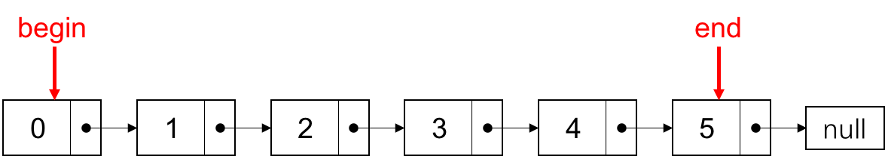
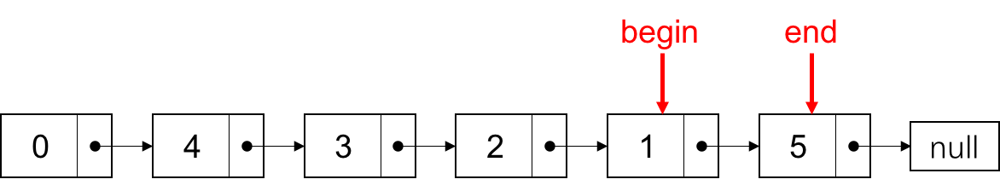
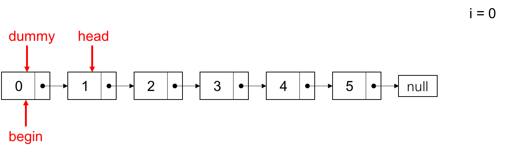
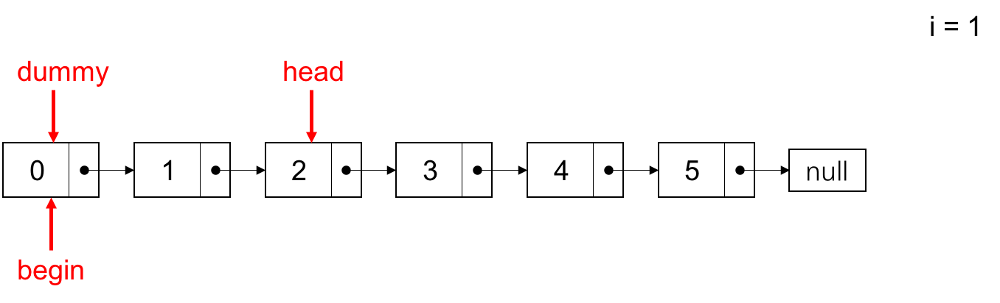
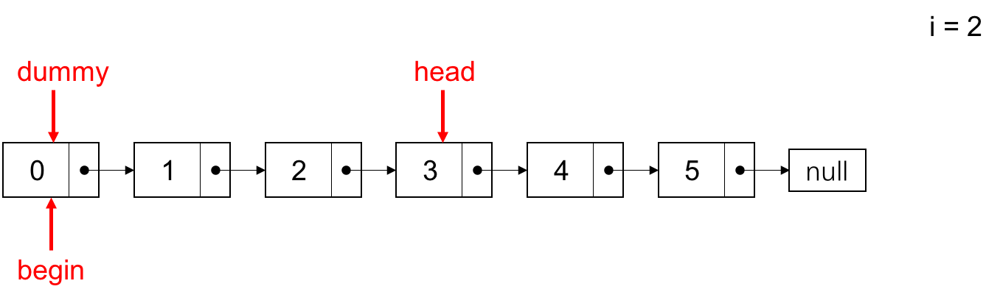
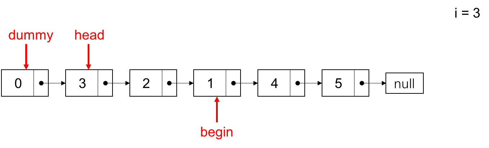

> 更多 LeetCode 题解笔记可以访问我的 [github](https://github.com/Genpeng/play-with-leetcode)。

[TOC]

# 描述

给出一个链表，每 *k* 个节点一组进行翻转，并返回翻转后的链表。

*k* 是一个正整数，它的值小于或等于链表的长度。如果节点总数不是 *k* 的整数倍，那么将最后剩余节点保持原有顺序。

**示例 :**

给定这个链表：`1->2->3->4->5`

当 *k* = 2 时，应当返回: `2->1->4->3->5`

当 *k* = 3 时，应当返回: `3->2->1->4->5`

**说明 :**

- 你的算法只能使用常数的额外空间。
- **你不能只是单纯的改变节点内部的值**，而是需要实际的进行节点交换。

# 解法一：迭代

## 思路

要求解这道题，先要构造一个辅助函数，这个函数的作用就是翻转链表（不包括首尾节点）。假设输入链表如下图所示，其中链表表头为 `begin`，链表尾部为 `end`。



经过函数之后，链表的连接变为如下的形式，且将 `begin` 作为函数的输出。



具体的实现思路和 [LeetCode 第206题**翻转链表**](https://blog.csdn.net/x273591655/article/details/83306135)是一致的，只是函数的输入和输出有些不同，这里不在赘言，直接给出函数的实现。

```java
// Java 版本
private ListNode reverse(ListNode begin, ListNode end) {
    ListNode prev = begin, curr = begin.next;
    ListNode first = curr;
    while (curr != end) {
        ListNode next = curr.next;
        curr.next = prev;
        prev = curr;
        curr = next;
    }
    begin.next = prev;
    first.next = curr;
    return first;
}
```

```python
# Python 版本
def reverse(begin, end):
    prev, curr, first = begin, begin.next, begin.next
    while curr != end:
        curr.next, prev, curr = prev, curr, curr.next
        begin.next, first.next = prev, curr
        return first
```

有个上面的辅助函数之后，我们就可以利用它求解这道题。假设输入链表为 `1 -> 2 -> 3 -> 4 -> 5` 且 `k=3`，首先构造一个虚拟头节点 `dummy`，用于统一后面的一系列操作。初始时，设变量 `i=0`，当 `i+1` 不能被3整除时，将 `head` 指针向链表的下一个节点移动；当 `i+1` 能被3整除时，调用上面的辅助函数，将 `begin` 节点和 `head.next` 节点之间的节点进行翻转。具体的操作可以看下面的图片演示。









之后，将 `head` 指针指向 `begin` 指针的下一个节点（这里为 `4`），即 `head = begin.next`。如此循环往复，直到 `head` 节点为 `null`，则结束所有操作。

## Java 实现

```java
/**
 * Definition for singly-linked list.
 * public class ListNode {
 *     int val;
 *     ListNode next;
 *     ListNode(int x) { val = x; }
 * }
 */
class Solution {
    public ListNode reverseKGroup(ListNode head, int k) {
        // boundary judgement
        boolean hasNoOrOneNode = (head == null || head.next == null);
        if (hasNoOrOneNode || k == 1) {
            return head;
        }

        ListNode dummy = new ListNode(-1);
        dummy.next = head;
        ListNode begin = dummy;
        int i = 0;
        while (head != null) {
            ++i;
            if (i % k == 0) {
                begin = reverse(begin, head.next);
                head = begin.next;
            } else {
                head = head.next;
            }
        }
        return dummy.next;
    }

    private ListNode reverse(ListNode begin, ListNode end) {
        ListNode prev = begin, curr = begin.next;
        ListNode first = curr;
        while (curr != end) {
            ListNode next = curr.next;
            curr.next = prev;
            prev = curr;
            curr = next;
        }
        begin.next = prev;
        first.next = curr;
        return first;
    }
}
// Runtime: 3 ms
// Your runtime beats 100.00 % of java submissions.
```

## Python 实现

```python
# Definition for singly-linked list.
# class ListNode:
#     def __init__(self, x):
#         self.val = x
#         self.next = None

class Solution:
    def reverseKGroup(self, head, k):
        """
        :type head: ListNode
        :type k: int
        :rtype: ListNode
        """
        has_no_or_one_node = (not head or not head.next)
        if has_no_or_one_node or k == 1:
            return head
        
        dummy = ListNode(-1)
        dummy.next = head
        begin = dummy
        i = 0
        while head:
            i += 1
            if i % k == 0:
                begin = self._reverse(begin, head.next)
                head = begin.next
            else:
                head = head.next
        return dummy.next
    
    def _reverse(self, begin, end):
        prev, curr, first = begin, begin.next, begin.next
        while curr != end:
            curr.next, prev, curr = prev, curr, curr.next
        begin.next, first.next = prev, curr
        return first
```

## 复杂度分析

- 时间复杂度：$O(n)$
- 空间复杂度：$O(1)$

# 解法二：递归（不满足空间复杂度）

## 思路

递归的思路和迭代的思路是一样的，也是对 k 个为一组的节点进行翻转，区别在于递归是按照从后往前的顺序分别对每组节点进行翻转，而迭代则是从前往后。

## Java 实现

```java
/**
 * Definition for singly-linked list.
 * public class ListNode {
 *     int val;
 *     ListNode next;
 *     ListNode(int x) { val = x; }
 * }
 */
class Solution {
    public ListNode reverseKGroup(ListNode head, int k) {
        ListNode curr = head;
        int i = 0;
        while (curr != null && i < k) {
            ++i;
            curr = curr.next;
        }
        
        if (i == k) {
            curr = reverseKGroup(curr, k);
            while (i > 0) {
                ListNode tmp = head.next;
                head.next = curr;
                curr = head;
                head = tmp;
                --i;
            }
            head = curr;
        }
        return head;
    }
}
```

## Python 实现

```python
# Definition for singly-linked list.
# class ListNode:
#     def __init__(self, x):
#         self.val = x
#         self.next = None

class Solution:
    def reverseKGroup(self, head, k):
        """
        :type head: ListNode
        :type k: int
        :rtype: ListNode
        """
        curr = head
        i = 0
        while curr and i < k:
            curr = curr.next
            i += 1
        
        if i == k:
            curr = self.reverseKGroup(curr, k)
            while i > 0:
                head.next, head, curr = curr, head.next, head
                i -= 1
            head = curr
        return head
```

## 复杂度分析

- 时间复杂度：$O(n)$
- 空间复杂度：$O(n)$

