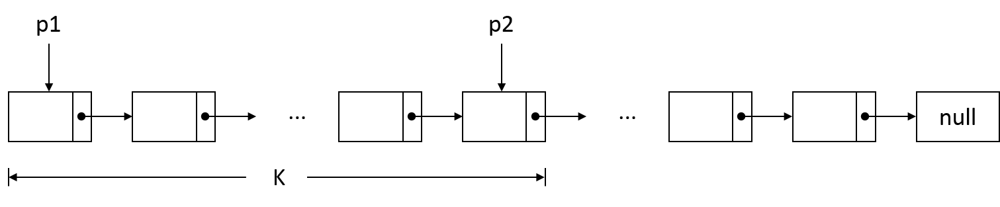
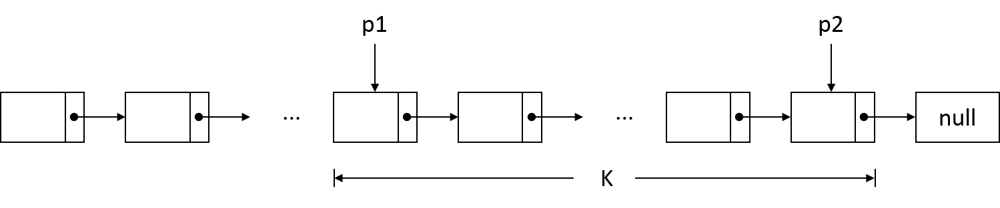

> 更多 LeetCode 题解笔记可以访问我的 [github](https://github.com/Genpeng/play-with-leetcode)。

[TOC]

# 描述

给定一个链表，旋转链表，将链表每个节点向右移动 *k* 个位置，其中 *k* 是非负数。

**示例 1:**

```
输入: 1->2->3->4->5->NULL, k = 2
输出: 4->5->1->2->3->NULL
解释:
向右旋转 1 步: 5->1->2->3->4->NULL
向右旋转 2 步: 4->5->1->2->3->NULL
```

**示例 2:**

```
输入: 0->1->2->NULL, k = 4
输出: 2->0->1->NULL
解释:
向右旋转 1 步: 2->0->1->NULL
向右旋转 2 步: 1->2->0->NULL
向右旋转 3 步: 0->1->2->NULL
向右旋转 4 步: 2->0->1->NULL
```

# 解法：双指针

## 思路

求解这道题等价于**<u>找到链表倒数第 k 个节点，然后将之前的所有节点放到链表的尾部，形成一个新的链表</u>**，相当于 [LeetCode 第 19 题]()的进阶版。

对于寻找单向链表的倒数第 $k$ 个元素问题，可以采用双指针的方法进行求解。

- 令指针 `p1` 和指针 `p2` 均指向表头，然后让指针 `p2` 跳转 $k - 1$ 次，此时指针 `p2` 处于链表的第 $k$ 个节点



- 接着，让两个指针同时向链表尾部跳转，直到指针 `p2` 处于链表的尾部，此时，指针 `p1` 指向的节点正是链表的倒数第 $k$ 个节点



在找到倒数第 $k$ 个节点后，只需要将指针 `p2` 指向链表头 `head`、指针 `p1` 的前一个节点的 `next` 指针指向 `null`，最后指针 `p1` 就是新的链表的表头。

值得注意的是，在这道题中，我们需要找到的是链表的倒数第 $k+1$ 个节点，从而才能对该节点的 `next` 指针进行操作（指向 `null`）。同样地，也需要注意一些边界情况，比如表头 `head` 为空，`k` 大于链表长度等。

## Java 实现

```java
/**
 * Definition for singly-linked list.
 * public class ListNode {
 *     int val;
 *     ListNode next;
 *     ListNode(int x) { val = x; }
 * }
 */
class Solution {
    public ListNode rotateRight(ListNode head, int k) {
        // 边界情况处理
        if (head == null) {
        	return head;
        }

        // 统计链表长度并对k进行取余操作
        int length = 1;
        ListNode tmp = head;
        while (tmp.next != null) {
        	tmp = tmp.next;
        	++length;
        }
        k = k % length;
        if (k == 0) {
        	return head;
        }

        // 寻找倒数第k+1个节点
        ListNode p1 = head, p2 = head;
        for (int i = 0; i < k; ++i) {
        	p2 = p2.next;
        }
        while (p2.next != null) {
        	p1 = p1.next;
        	p2 = p2.next;
        }

        // 旋转链表
        ListNode newHead = p1.next;
        p1.next = null;
        p2.next = head;

        return newHead;
    }
}
// Runtime: 6 ms
// Your runtime beats 100.00 % of java submissions.
```

## Python 实现

```python
# Definition for singly-linked list.
# class ListNode:
#     def __init__(self, x):
#         self.val = x
#         self.next = None

class Solution:
    def rotateRight(self, head, k):
        """
        :type head: ListNode
        :type k: int
        :rtype: ListNode
        """
        # 边界情况处理
        if not head:
            return head
        
        # 统计链表的长度并对k进行取余操作
        tmp, n = head, 1
        while tmp.next:
            tmp, n = tmp.next, n + 1
        k = k % n
        if k == 0:
            return head
        
        # 找到倒数第k+1个节点
        p1, p2 = head, head
        for i in range(k):
            p2 = p2.next
        while p2.next:
            p1 = p1.next
            p2 = p2.next
        
        # 旋转链表
        new_head = p1.next
        p1.next, p2.next = None, head
        return new_head
        
# Runtime: 44 ms
# Your runtime beats 99.11 % of python3 submissions.
```

## 复杂度分析

- 时间复杂度：$O(n)$，其中 $n$ 表示链表的长度。首先需要迭代 $n$ 次找出链表的长度，接着让指针 `p2` 迭代 $k$ 次到达第 $k+1$ 个节点的位置，最后还需要迭代 $n-(k+1)$ 次使得两个指针一个指向链表尾部，一个指向倒数第 $k+1$ 个节点，而迭代所执行的操作的时间复杂度都是 $O(1)$ 的，所以最后总的时间复杂度是 $O(n)$ 的
- 空间复杂度：$O(1)$