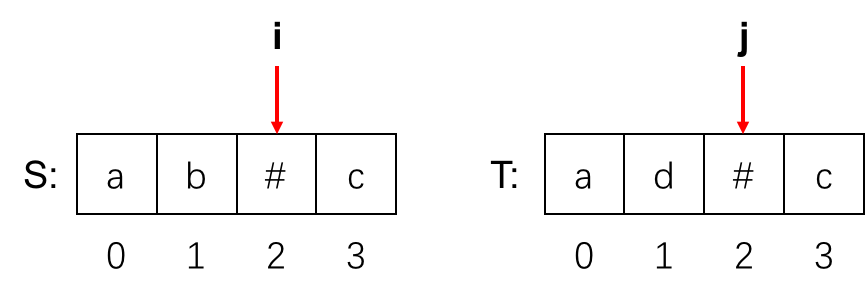
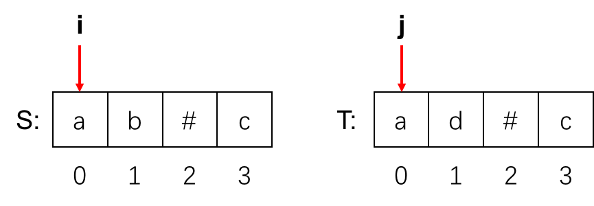

> 更多 LeetCode 题解笔记可以访问我的 [github](https://github.com/Genpeng/play-with-leetcode)。

[TOC]

# 描述

给定 `S` 和 `T` 两个字符串，当它们分别被输入到空白的文本编辑器后，判断二者是否相等，并返回结果。 `#` 代表退格字符。

**示例 1：**

```
输入：S = "ab#c", T = "ad#c"
输出：true
解释：S 和 T 都会变成 “ac”。
```

**示例 2：**

```
输入：S = "ab##", T = "c#d#"
输出：true
解释：S 和 T 都会变成 “”。
```

**示例 3：**

```
输入：S = "a##c", T = "#a#c"
输出：true
解释：S 和 T 都会变成 “c”。
```

**示例 4：**

```
输入：S = "a#c", T = "b"
输出：false
解释：S 会变成 “c”，但 T 仍然是 “b”。
```

**提示：**

1. `1 <= S.length <= 200`
2. `1 <= T.length <= 200`
3. `S` 和 `T` 只含有小写字母以及字符 `'#'`。

# 解法一：字符串比较

## 思路

当拿到这道题时，可能最直接的想法就是<u>**将两个字符串所对应的结果进行比较**</u>。为了能够得到字符串所对应的结果，需要借助栈来模拟键入的过程。从左往右遍历字符串，如果当前的字符并不是退格字符 `#`，那么就将当前的字符压入栈中；如果当前的字符是退格字符且栈不为空，那么就将栈顶的元素弹出。最后，栈中剩余字符所组成的字符串即为所求。

## Java 实现

```java
class Solution {
    public boolean backspaceCompare(String S, String T) {
        return build(S).compare(build(T));
    }

    private String build(String s) {
        Stack<Character> stack = new Stack<>();
        for (char c : s.toCharArray()) {
            if (c != '#') {
                stack.push(c);
            } else if (!stack.isEmpty()) {
                stack.pop();
            }
        }
        return String.valueOf(stack);
    }
}
```

## Python 实现

```python
class Solution:
    def backspaceCompare(self, S, T):
        """
        :type S: str
        :type T: str
        :rtype: bool
        """
        def build(s):
            stack = []
            for c in s:
                if c != '#':
                    stack.append(c)
                elif stack:
                    stack.pop()
            return ''.join(stack)
        return build(S) == build(T)
```

## 复杂度分析

- 时间复杂度：$O(m + n)$，其中 $m$ 和 $n$ 分别表示字符串 `S` 和 `T` 的长度。
- 空间复杂度：$O(m + n)$ 

# 解法二：双指针（推荐）

## 思路

第二种解法本质上也是对字符串所对应的结果进行比较，只不过与解法一不同的是，**<u>解法二是逐个字符进行比较</u>**，当发现有字符不相等时，返回 `false`。为了能对两个字符串所对应的结果进行比较，需要两个指针，用于指向比较的字符。与此同时，当遇到退格符 `#` 时，跳过下一个非退格符的符号，取下下个字符进行比较。为了能够更加生动地说明这个过程，采用了示例1的两个字符作为函数的输入（`S="ab#c"`、`T="ad#c"`），用于演示整个过程，具体的过程见下面的一系列图片。

- 初始时， `i=3`、`j=3`，此时由于两个索引所对应的字符并不是退格符，直接进行比较（结果相等，`i` 和 `j` 都减一进入下一次循环）


- 当 `i=2`、`j=2` 时，此时两个索引所对应的字符都是退格符，因此跳过下一个非退格符的字符（字符串 `S` 中是字符 `b`，而字符串 `T` 中是字符 `d`）



- 当 `i=0`、`j=0` 时，此时两个索引所对应的字符都不是退格符，再一次进行比较，结果相等，至此循环结束，最终函数返回结果为 `true`



## Java 实现

```java
class Solution {
    public boolean backspaceCompare(String S, String T) {
        int i = S.length() - 1, j = T.length() - 1;
        int sSkip = 0, tSkip = 0;
        
        while (i >= 0 || j >= 0) {
            // 找到字符串S所对应的结果的下一个字符
            while (i >= 0) {
                if (S.charAt(i) == '#') {
                    --i;
                    ++sSkip;
                } else if (sSkip > 0) {
                    --i;
                    --sSkip;
                } else {
                    break;
                }
            }
            
            // 找到字符串T所对应的结果的下一个字符
            while (j >= 0) {
                if (T.charAt(j) == '#') {
                    --j;
                    ++tSkip;
                } else if (tSkip > 0) {
                    --j;
                    --tSkip;
                } else {
                    break;
                }
            }
            
            // 如果索引i和j所对应的字符不相等，返回false
            if (i >= 0 && j >= 0 && S.charAt(i) != T.charAt(j)) {
                return false;
            }
            
            // 如果遍历完一个字符串的同时，另一个字符串还未遍历完，返回false
            if ((i >= 0) != (j >= 0)) {
                return false;
            }
            
            --i;
            --j;
        }
        return true;
    }
}
```

## Python 实现

```python
class Solution:
    def backspaceCompare(self, S, T):
        """
        :type S: str
        :type T: str
        :rtype: bool
        """
        i, j, s_skip, t_skip = len(S) - 1, len(T) - 1, 0, 0
        while i >= 0 or j >= 0:
            # 找到字符串S所对应结果的下一个字符
            while i >= 0:
                if S[i] == '#':
                    i -= 1
                    s_skip += 1
                elif s_skip > 0:
                    i -= 1
                    s_skip -= 1
                else:
                    break
            
            # 找到字符串T所对应结果的下一个字符
            while j >= 0:
                if T[j] == '#':
                    j -= 1
                    t_skip += 1
                elif t_skip > 0:
                    j -= 1
                    t_skip -= 1
                else:
                    break
            
            # 如果索引i和j所对应的字符不相等，返回False
            if i >= 0 and j >= 0 and S[i] != T[j]:
                return False
            
            # 如果遍历完一个字符的同时，另一个字符还未遍历完，返回False
            if (i >= 0) != (j >= 0):
                return False
            
        return True
# Time Limit Exceeded
```

## 复杂度分析

- 时间复杂度：$O(m + n)$，其中 $m$ 和 $n$ 分别表示字符串 `S` 和 `T` 的长度。
- 空间复杂度：$O(1)$ 


